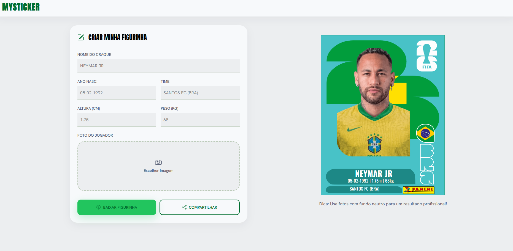

# MySticker ⚽🏆
Crie sua própria figurinha inspirada nos álbuns de Copa do Mundo!

O MySticker permite personalizar uma figurinha com seus dados, foto e time favorito, gerando uma imagem pronta para download e compartilhamento.

## ✨ Funcionalidades
- 📸 Upload de foto personalizada
- ✏️ Atualização em tempo real dos dados da figurinha
- 🏷️ Personalização de:
Nome
Data de nascimento
Altura
Peso
Clube/Seleção
- ⬇️ Download da figurinha em PNG
- 📱 Layout responsivo
- ⚡ Interface rápida e intuitiva

## 🚀 Tecnologias
- React
- Vite
- Tailwind CSS
- html-to-image
- React Icons

## 📷 Preview


## 🛠️ Instalação
1. Clone o repositório:
```
git clone https://github.com/endriusssantos/mysticker
```

2. Acesse a pasta:
```
cd mysticker
```

3. Instale as dependências:
```
npm install
```

4. Execute o projeto:
```
npm run dev
```

## 🎯 Objetivo do Projeto
Este projeto foi desenvolvido para praticar conceitos de:

- Gerenciamento de estado com React
- Manipulação de arquivos (upload de imagens)
- Geração de imagens a partir de componentes React
- Responsividade com Tailwind CSS
- Estruturação de projetos Front-end modernos

## 🌎 Deploy
[Versão Online](https://mysticker-seven.vercel.app/)

## 👨‍💻 Autor
Desenvolvido por Endrius da Silva Santos.

[LinkedIn](linkedin.com/in/endrius-da-silva-dos-santos-8a7113328/)
[GitHub](https://github.com/endriusssantos)

⭐ Se gostou do projeto, deixe uma estrela no repositório!